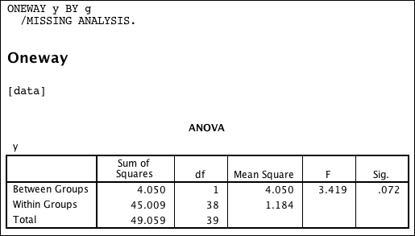
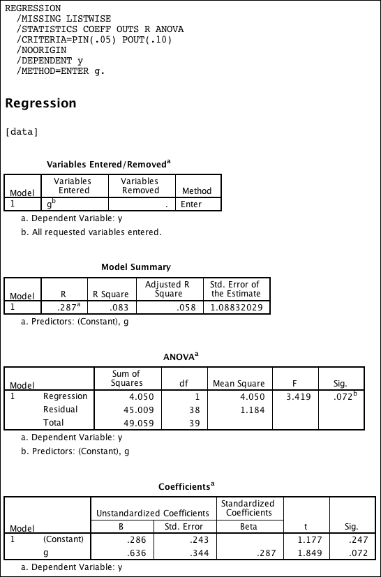

(One-Way) ANOVA is Linear Regression
========================================================
To demonstrate how a one-way anova is in fact a linear regression model we simulate some example data.

```{r}
# set seed for RNG
set.seed(77)

# outcome:
# two independent sets of normal distributed variables of length 20 with mean=0 and mean=1 respectivily, and sd=1 each.
y <- round(c(rnorm(20,0,1), rnorm(20,1,1)), digits=5)

# group variable:
# two groups with 20 pupils each
g <- factor(c(rep(0,20), rep(1,20)))

# save data
data <- data.frame(y=y, g=g)
write.table(data, "data.csv", sep=";", row.names=FALSE, quote = FALSE)
```

Now we apply the liner model to the data. The key thing is, that the **only predictor is the group variable**.

```{r}
m <- lm(y~g)
```

We print summary and the variance table.
```{r}
summary(m)
anova(m)
```

It is just the straightforward way in R to get the table of variance.

Let us see how it is done in SPSS.

First the one-way ANOVA.



Then the linear regression.



Compare both tables of variance from the SPSS output above and see how they represent the **exact same values**, though they are labelled different.


_