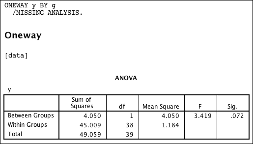
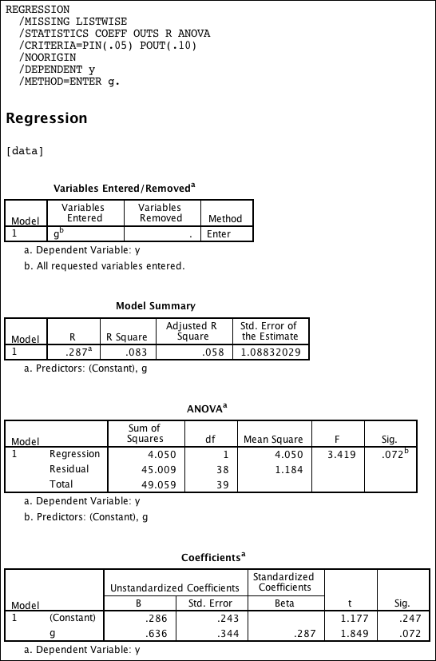

(One-Way) ANOVA is Linear Regression
========================================================
To demonstrate how a one-way anova is in fact a linear regression model we simulate some example data.


```r
# set seed for RNG
set.seed(77)

# outcome: two independent sets of normal distributed variables of length 20
# with mean=0 and mean=1 respectivily, and sd=1 each.
y <- round(c(rnorm(20, 0, 1), rnorm(20, 1, 1)), digits = 5)

# group variable: two groups with 20 pupils each
g <- factor(c(rep(0, 20), rep(1, 20)))

# save data
data <- data.frame(y = y, g = g)
write.table(data, "data.csv", sep = ";", row.names = FALSE, quote = FALSE)
```


Now we apply the liner model to the data. The key thing is, that the **only predictor is the group variable**.


```r
m <- lm(y ~ g)
```


We print summary and the variance table.

```r
summary(m)
```

```
## 
## Call:
## lm(formula = y ~ g)
## 
## Residuals:
##    Min     1Q Median     3Q    Max 
## -3.228 -0.488 -0.064  0.742  1.908 
## 
## Coefficients:
##             Estimate Std. Error t value Pr(>|t|)  
## (Intercept)    0.286      0.243    1.18    0.247  
## g1             0.636      0.344    1.85    0.072 .
## ---
## Signif. codes:  0 '***' 0.001 '**' 0.01 '*' 0.05 '.' 0.1 ' ' 1
## 
## Residual standard error: 1.09 on 38 degrees of freedom
## Multiple R-squared:  0.0825,	Adjusted R-squared:  0.0584 
## F-statistic: 3.42 on 1 and 38 DF,  p-value: 0.0722
```

```r
anova(m)
```

```
## Analysis of Variance Table
## 
## Response: y
##           Df Sum Sq Mean Sq F value Pr(>F)  
## g          1      4    4.05    3.42  0.072 .
## Residuals 38     45    1.18                 
## ---
## Signif. codes:  0 '***' 0.001 '**' 0.01 '*' 0.05 '.' 0.1 ' ' 1
```


It is just the straightforward way in R to get the table of variance.

Let us see how it is done in SPSS.

First the one-way ANOVA.



Then the linear regression.



Compare both tables of variance from the SPSS output above and see how they represent the **exact same values**, though they are labelled different.


_
